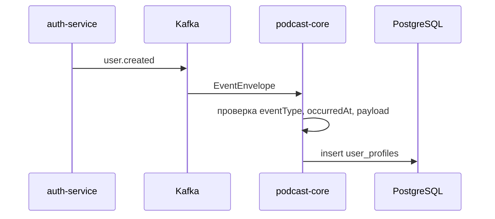

# Поток Kafka-сообщений

## Входящий поток пользователя

`auth-service` публикует событие `user.created` в topic `podcasts.users`. Микросервис подкастов читает событие consumer group `podcast-service`, валидирует envelope и создаёт локальный `user_profiles`.



## Формат envelope

```json
{
  "eventType": "user.created",
  "occurredAt": "2026-05-23T10:00:00Z",
  "payload": {
    "userId": "00000000-0000-0000-0000-000000000001",
    "username": "dev-user"
  }
}
```

## Повторные попытки и DLT

Kafka error handler выполняет до трёх повторных попыток с задержкой 1000 мс для ретрайных ошибок. Неретрайные ошибки сразу отправляются в DLT.

| Ошибка | Поведение |
|---|---|
| `InvalidKafkaMessageException` | без retry, отправка в DLT |
| `KafkaDeserializationException` | без retry, отправка в DLT |
| `KafkaMessageValidationException` | без retry, отправка в DLT |
| `IllegalArgumentException` | без retry, отправка в DLT |
| прочие runtime ошибки | retry, затем DLT |

DLT topic формируется как `<исходный topic>.DLT`, например `podcasts.users.DLT`.
