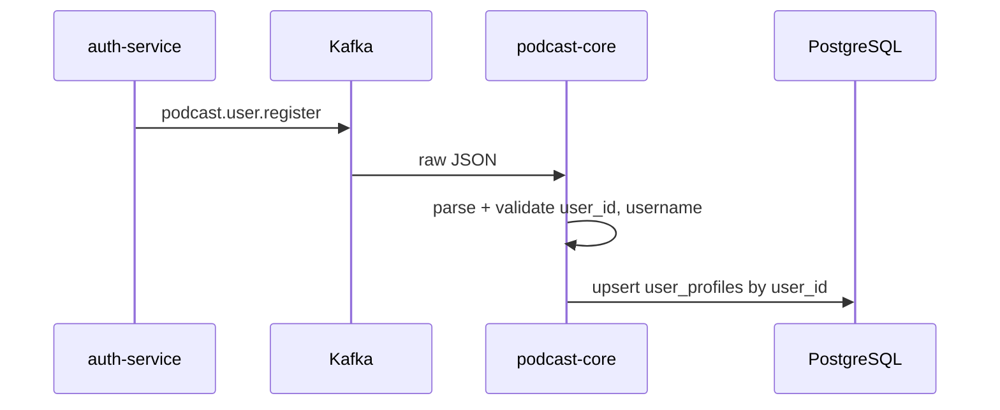
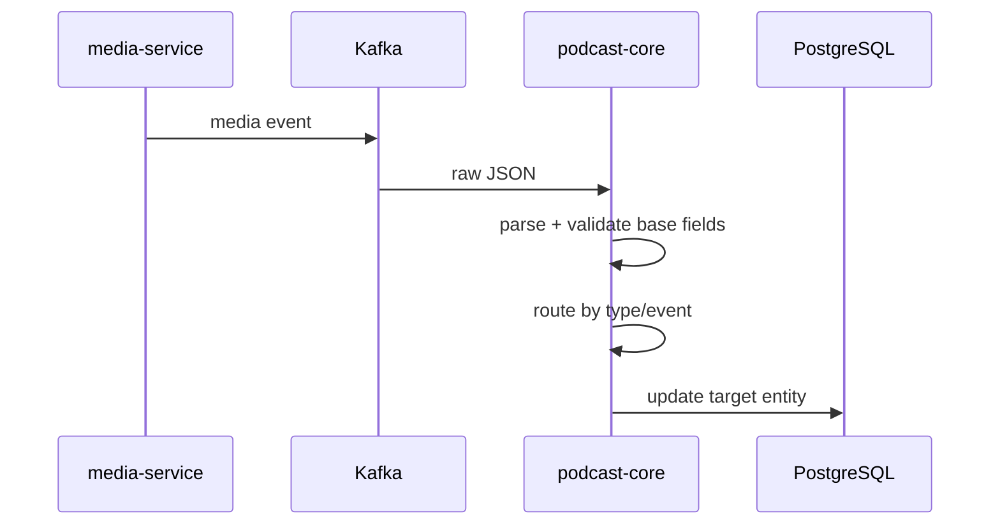

# Поток Kafka-сообщений

## Регистрация пользователя

`auth-service` публикует raw JSON в topic `podcast.user.register`. Микросервис подкастов создаёт или обновляет локальный `user_profiles`.

## Media flow

Topic `media` передаёт только метаданные загрузки. Файлы через Kafka не передаются.

## Состояния `podcast_file`

| Событие | Поведение |
|---|---|
| `start_upload` | `DRAFT`, `FAILED`, `UPLOAD_ERROR` переходят в `PROCESSING`; `READY_TO_PUBLISH`, `PUBLISHED`, `ARCHIVED` не откатываются |
| `uploaded` | сохраняются `audio_url`, `audio_url_file`, `audio_size_file`; статус становится `READY_TO_PUBLISH`, кроме `PUBLISHED` и `ARCHIVED` |
| `error` | статус становится `UPLOAD_ERROR`, кроме `READY_TO_PUBLISH`, `PUBLISHED`, `ARCHIVED` |

## Повторные попытки и DLT

Kafka error handler выполняет retry для `KafkaRetryableProcessingException` и прочих runtime ошибок. Невалидные сообщения и неизвестные `type/event` отправляются в DLT без повторов.
